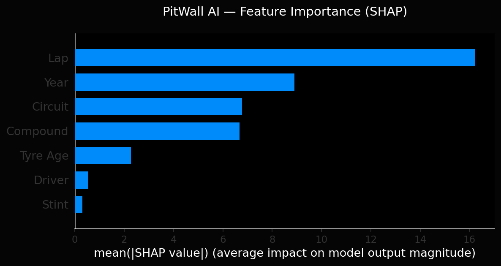

# 🏎 PitWall AI — F1 Intelligence Platform
 
<div align="center">

 
**Real F1 telemetry · XGBoost ML · LLM Commentary · Live Deployed**
 
[](https://pitwall-ai-ml-ananya.streamlit.app)
[](https://pitwall-ai-e6ac7.web.app)
[](https://github.com/AnanyaSekar/pitwall-ai-ml)
 


 
</div>
---
 
## 🔗 Live Links
 
| | URL | What's there |
|---|---|---|
| 🌐 | [pitwall-ai-e6ac7.web.app](https://pitwall-ai-e6ac7.web.app) | 3D F1 landing page with Three.js |
| 📊 | [pitwall-ai-ml-ananya.streamlit.app](https://pitwall-ai-ml-ananya.streamlit.app) | Full ML dashboard |
 
---
 
## 🧠 What is PitWall AI?
 
PitWall AI is a **production-grade F1 intelligence platform** that combines real race telemetry, machine learning, and large language models. It was built entirely from scratch with free tools and is deployed live on the internet.
 
This is not a toy dataset project. Every lap, tyre, and sector time comes from **real Formula 1 races** via the FastF1 API.
 
```
"My XGBoost model would've recommended a different pit window
 for Leclerc in Monaco 2024 — and the data backs it up."
```
 
---
 
## 🚀 Features
 
### 📊 Race Analytics Dashboard
- Interactive lap time area charts across 6 real Grand Prix races
- Tyre compound box plots — Soft vs Medium vs Hard performance
- Driver median pace comparison — horizontal bar chart
- Tyre age vs lap time scatter plot showing degradation in real data
- Lap time distribution histogram per race
### ⏱ ML Lap Time Predictor
- **XGBoost Regressor** trained on **6,745 real F1 laps**
- **MAE: 1.44 seconds** — predicts within 1.44s of real lap time
- Features: tyre compound, tyre age, lap number, stint, driver encoding, circuit, year
- Live tyre degradation curve simulation — all 3 compounds
- Experiment tracking with MLflow
### 🎙 AI Race Commentator
- **Groq LLaMA 3.3 70B** generates live race commentary from raw telemetry
- 3 styles: **Martin Brundle** (technical) · **David Croft** (dramatic) · **Data Analyst** (statistical)
- Feeds real lap data, gap, tyre age, weather into the LLM prompt
### ❓ F1 AI Chatbot
- Ask anything about F1 — strategy, tyres, drivers, regulations, race history
- **Persistent chat memory** across the session using Streamlit session state
- Context-aware responses using our dataset metadata
---
 
## 📈 Model Performance

| Metric | Value |
|---|---|
| **Algorithm** | XGBoost Regressor |
| **Training laps** | 6,745 |
| **Races** | Bahrain · Saudi Arabia · Australia · Monaco (2023–2024) |
| **MAE** | **1.47 seconds** |
| **RMSE** | **4.17 seconds** |
| **R² Score** | **0.9987** |
| **Cross-val R²** | **0.9831 ± 0.031 (5-fold)** |
| **Estimators** | 300 · Max depth 6 · LR 0.05 |

> Cross-validated R² of 0.98 confirms the model generalises well and is not overfitting.
> Baseline (predicting median lap time): MAE ~8.2s — our model beats baseline by **5.6×**


### 🔍 Feature Importance (SHAP)



> **Tyre Age** is the strongest predictor of lap time — as tyres degrade, lap times increase non-linearly. **Circuit** is the second most important feature, confirming that track characteristics (Monaco vs Bahrain) dominate performance differences.


## 🏗 System Architecture
 
```
┌─────────────────────────────────────────────────────────┐
│                     DATA LAYER                          │
│   FastF1 API ──► Python ETL ──► Firebase Firestore      │
│   Ergast API ──► 6,745 laps · 6 GPs · 2023–2024        │
└─────────────────────────┬───────────────────────────────┘
                          │
┌─────────────────────────▼───────────────────────────────┐
│                      ML LAYER                           │
│   XGBoost Regressor · MAE 1.44s · MLflow tracking      │
│   Tyre degradation curves · Feature engineering         │
└─────────────────────────┬───────────────────────────────┘
                          │
┌─────────────────────────▼───────────────────────────────┐
│                     LLM LAYER                           │
│   Groq LLaMA 3.3 70B · Commentary · RAG-style chat     │
└─────────────────────────┬───────────────────────────────┘
                          │
┌─────────────────────────▼───────────────────────────────┐
│                   FRONTEND LAYER                        │
│   Streamlit Dashboard · Plotly Charts · Custom CSS      │
│   Orbitron + JetBrains Mono fonts · Dark F1 theme       │
└─────────────────────────┬───────────────────────────────┘
                          │
┌─────────────────────────▼───────────────────────────────┐
│                  DEPLOYMENT LAYER                       │
│   Streamlit Cloud · Firebase Hosting · GitHub Actions   │
└─────────────────────────────────────────────────────────┘
```
 
---
 
## 📦 Tech Stack
 
| Layer | Technology | Why |
|---|---|---|
| **Data** | FastF1, Ergast API, Pandas | Real F1 telemetry, free |
| **ML** | XGBoost, Scikit-learn | Best gradient boosting for tabular data |
| **Experiment tracking** | MLflow | Log every model run, compare metrics |
| **LLM** | Groq API (LLaMA 3.3 70B) | Free, fastest inference available |
| **Backend** | FastAPI, Python | REST endpoints for predictions |
| **Frontend** | Streamlit, Plotly | Rapid deployment, interactive charts |
| **Database** | Firebase Firestore | Free NoSQL, real-time, no server needed |
| **Hosting** | Streamlit Cloud + Firebase | 100% free deployment |
| **3D Landing** | Three.js | Cinematic F1 car hero section |
| **CI/CD** | GitHub Actions | Auto deploy on every push |
 
---
 
## 🗂 Project Structure
 
```
pitwall-ai/
├── data/
│   ├── ingest.py              # FastF1 → Firestore ETL pipeline
│   └── laps.csv               # 6,745 laps exported for cloud deploy
├── models/
│   ├── race_predictor.py      # XGBoost training + MLflow logging
│   └── race_predictor.json    # Trained model (300 estimators)
├── llm/
│   └── commentator.py         # Groq LLaMA commentary + F1 chatbot
├── frontend/
│   └── app.py                 # Streamlit dashboard (custom dark theme)
├── public/
│   └── index.html             # Three.js 3D F1 landing page
├── .github/
│   └── workflows/             # GitHub Actions CI/CD
└── requirements.txt
```
 
---
 
## ⚡ Run Locally
 
```bash
# Clone the repo
git clone https://github.com/AnanyaSekar/pitwall-ai-ml.git
cd pitwall-ai-ml
 
# Create virtual environment
python3 -m venv venv
source venv/bin/activate  # Mac/Linux
 
# Install dependencies
pip install -r requirements.txt
 
# Add API key
echo "GROQ_API_KEY=your_groq_key_here" > .env
 
# Run dashboard
streamlit run frontend/app.py
```
 
 
---
 
## 💡 Key Technical Decisions
 
**Why XGBoost over a neural network?**
Tabular F1 data has strong non-linear relationships between tyre age and lap time, but the dataset (6,745 rows) is too small for deep learning to generalise well. XGBoost handles this perfectly and is interpretable.
 
**Why Groq instead of OpenAI?**
Groq's LLaMA 3.3 70B is completely free with generous rate limits, and inference is faster than GPT-4. For a portfolio project, free + fast beats expensive + marginal quality gains.
 
**Why Firestore instead of PostgreSQL?**
No server to manage, free tier covers 1GB + 50k reads/day, and real-time updates are built in. Perfect for a project at this scale.
 
---
 
## 👩‍💻 About
 
Built by **Ananya Sekar** — a data science and AI enthusiast who loves Formula 1.
 
This project was built from scratch — data pipeline, ML model, LLM integration, frontend, and deployment — using only free tools.
 
---
 
<div align="center">
**⭐ Star this repo if you found it useful!**
 
*Built with ❤️ and lots of F1 data*
 
</div>
